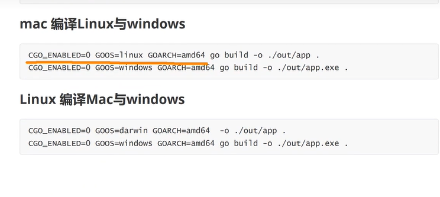

# golang debug
1. 本地调试
2. 附加到进程
3. 远程调试


# golang 的编译于与运 

## go build

1. 编译当前目录

```
go build 
或
go build .
```

2. 编译执行文件或目录

``` 

# 编译main文件. 将会生成可执行文件
go build ./main.go
# 编译执行文件目录p1. 不会产生编译文件, 仅进行编译检查
go build ./p1
```


3. main包由多个文件的情况, 执行文件编译包

```
# 编译时由多个文件的情况,指定文件编译main包
go build ./main.go ./hello.go
```

4. 编译时指定编译输出结果

``` 
go build -o ./out/app ./main.gon ./hello.go
```

## 运行 go run 

1. 直接通过 go run 运行main包,即可运行应用程序

``` 
# 运行应用程序时, 指定main包所有文件
go run ./main.go ./hello.go
# 运行应用程序时, 指定main包所在目录
```

## 交叉编译

交叉编译需要修改`GOOS,GOARCH,CGO_ENABLED`三个环境变量  
GOOS:目标平台的操作系统(darwin,freebsd,linux,windows)  
GOARCH: 目标平台的体系架构32位还是64位(()386,adm64,arm)  
CGO_ENABLED: 是否启用CGO,交叉编译不支持CGO所以要禁用它

windows编译Linux与Mac可执行程序

```  
# 设置环境变量
$Env:CGO_ENABKED=0;$Env:GOARCH="amd64";$Env:GOOS="linux"
#编译,并输出到app文件
go build -o ./out/app .

# 设置环境变量
$Env: CGO_ENABLED=0;$Env:GOARCH="amd64";$Env:GOOS="darwin"

# 编译,并输出到app文件
go build -o ./out/app .
```




# go mod命令

```
# 将模块下载到本地缓存,需要执行模块路径及版本阿红
go mod download
# 例如
go mod download github.com/gin-gonic/gin@v1.9.0

# 初始化一个新的模块到当前目录
go mod init
# 例如
go mod init gomodcase

# 添加缺少的依赖, 删除未使用的依赖(依赖对齐)
go mod tidy

# 通过工具或脚本编辑go.mod
go mod edit


# 根据go.mod中的依赖项制作vendor副本,有了vendor副本,项目将不再依赖本地缓存
go mod vendor

# 验证依赖是否正确
go mod verify

```


## go的执行流程


.go文件 (go build 指令) .exe文件, => 得到运行结果
        =>

.go文件 使用go run  编辑运行 => 得到运行结果


### 两种执行流程的区别

1. 如果先编译成可执行文件, 可以拷贝到没有go环境的机器上,仍然可以运行
2. 如果时go run 的原代码, 到其他机器上仍然需要go 开发环境
3. 在编辑时,编辑器会将程序依赖的库包含在可执行文件中, 所以可执行文件大了许多


### 编译和运行的注意事项

1. 有了go 源文件通过编译器将其编译成可执行的二进制文件
2. 在该源文件目录下, 通过go build 对 hello.go 文件进行编译, 可以指定生成的可执行文件名, 在windows 下必须是.exe文件
3. `go build -o <自定义文件名> <需要进行编译的文件名>` <= 指定编译成文件名的文件
4. 如果有操作, 编译是, 会在错误那行报错
